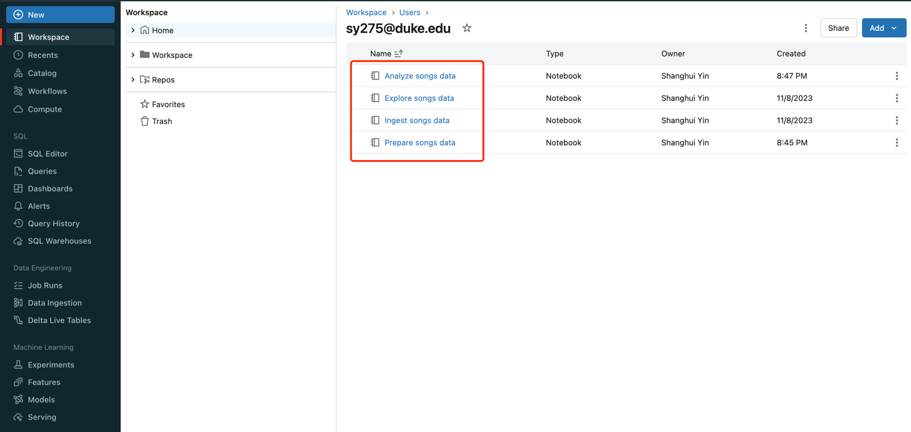
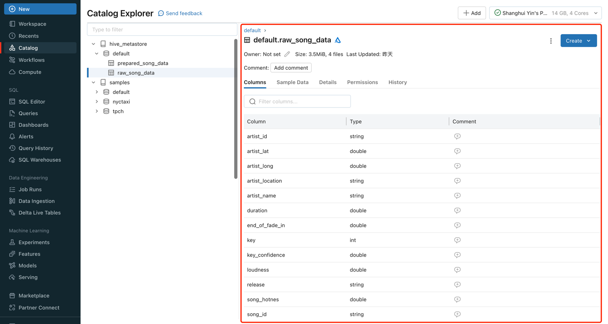
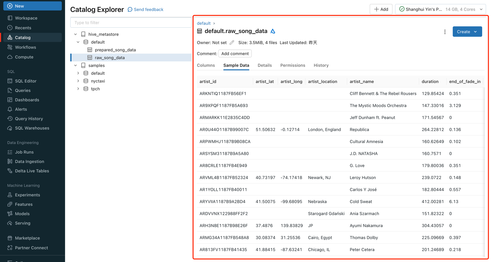
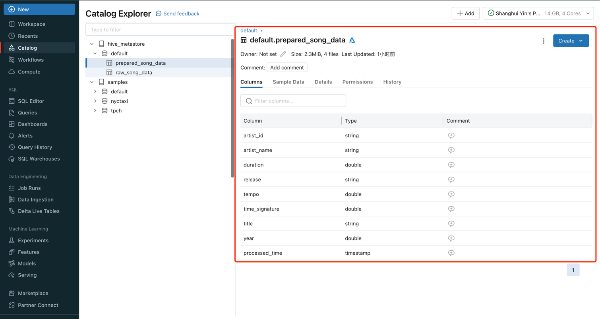
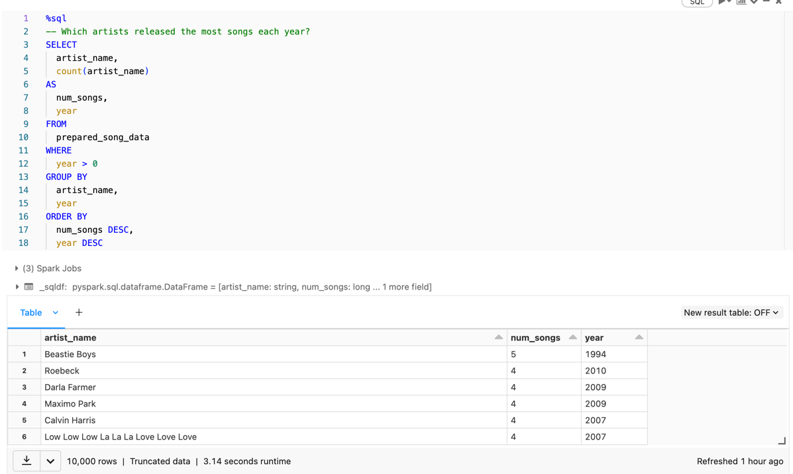
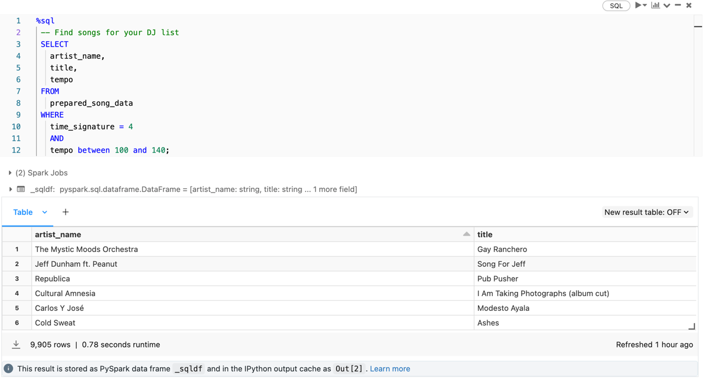
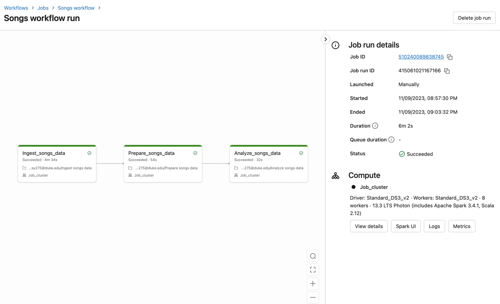
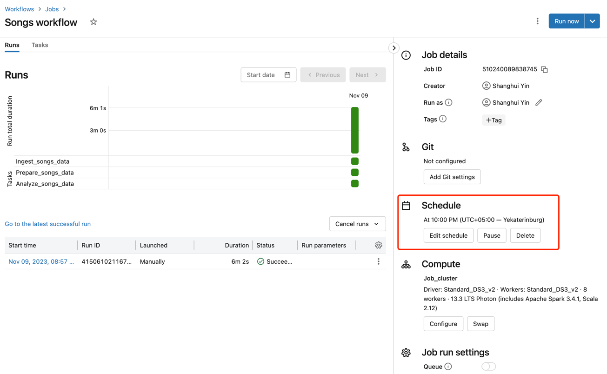

# Data Pipeline with Databricks

## Goal

> Duke University IDS 706 Weekly Mini Project 11

Create a data pipeline using Databricks

Include at least one data source and one data sink

## Preparation

1. Azure Databricks
2. Song Dataset

## Run and Result

### Create four Databricks notebooks

### Ingest the raw data
> column

> data

### Prepare the raw data

### Query the transformed data

> Which artists released the most songs each year?

> Find songs for your DJ list

### Create a Databricks job to run the pipeline

### Workflow
> Schedule the data pipeline job
> set as UTC+5 Everyday 22:00

## Reference

1.  https://github.com/nogibjj/python-template
2. https://docs.databricks.com/en/getting-started/data-pipeline-get-started.html
